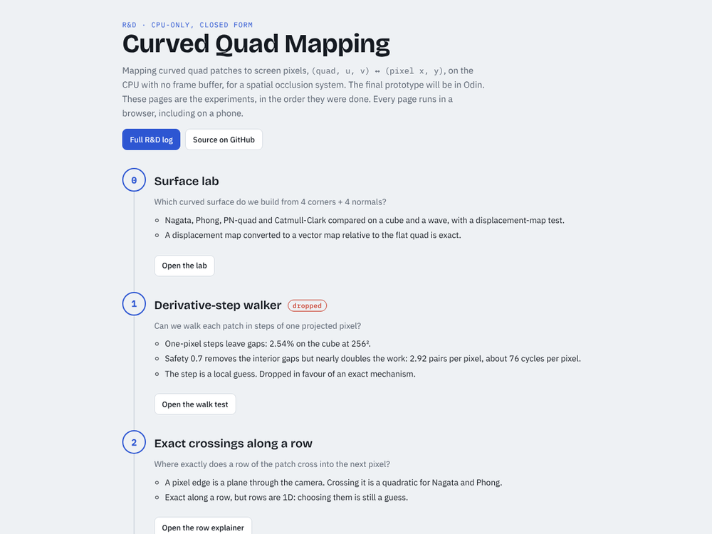
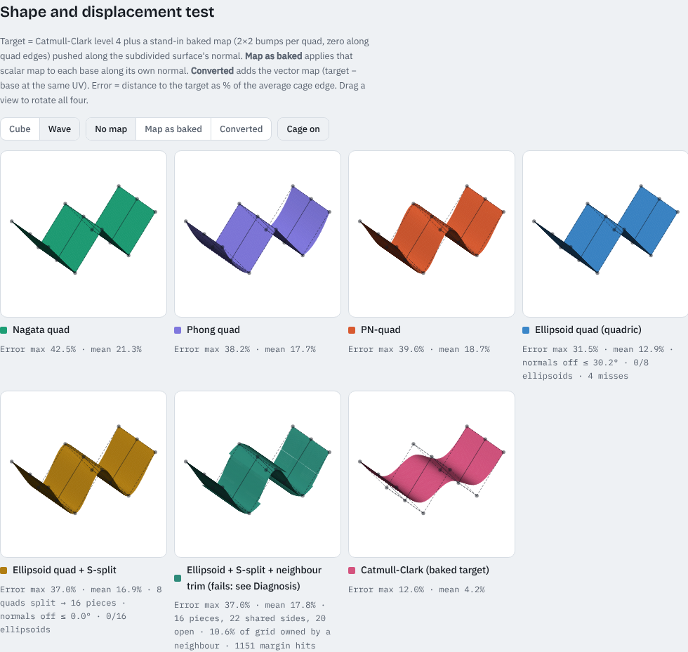
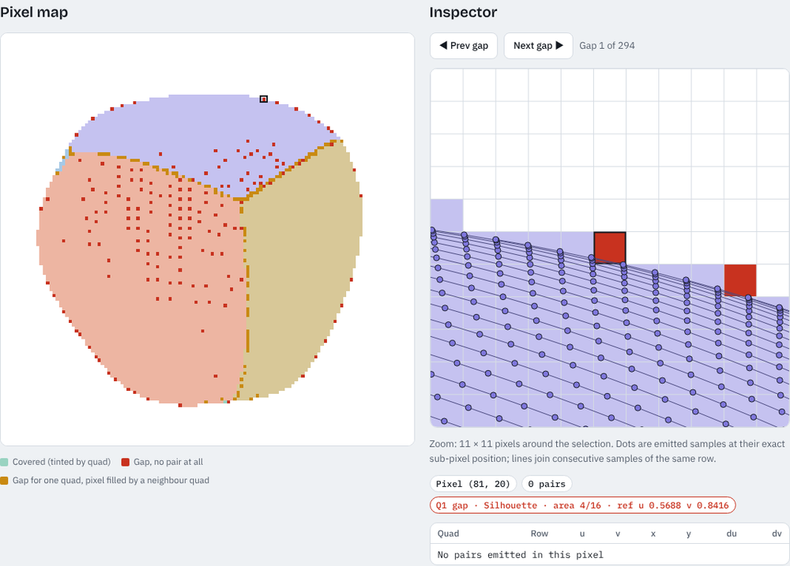
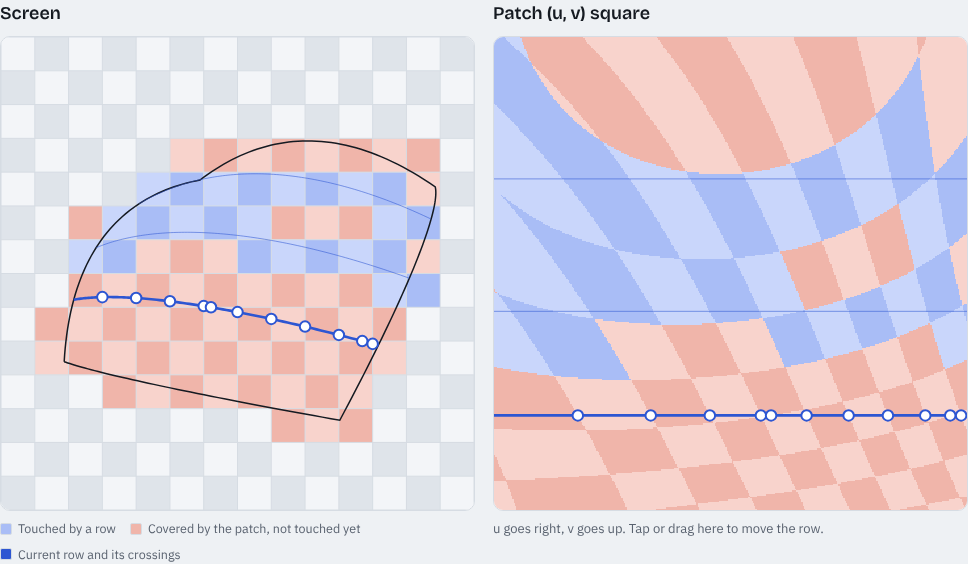
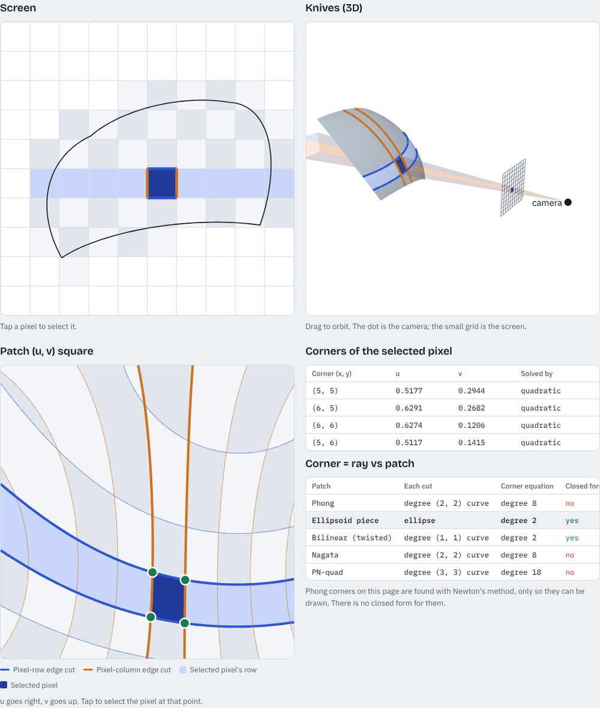
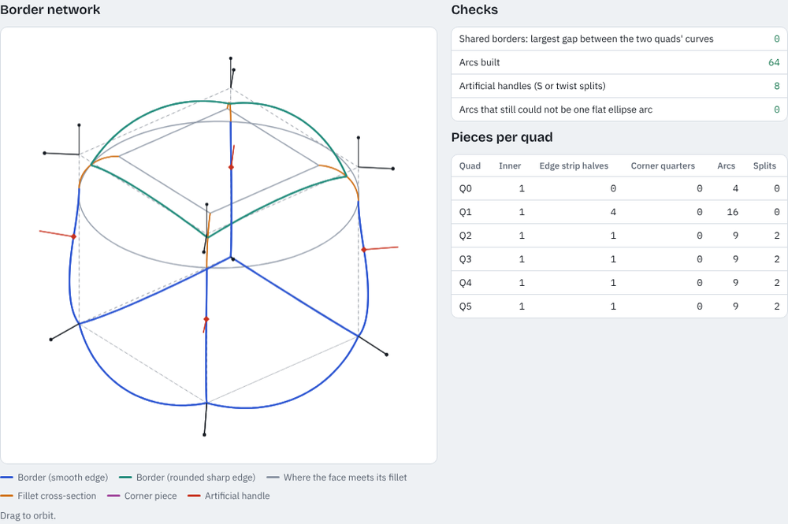
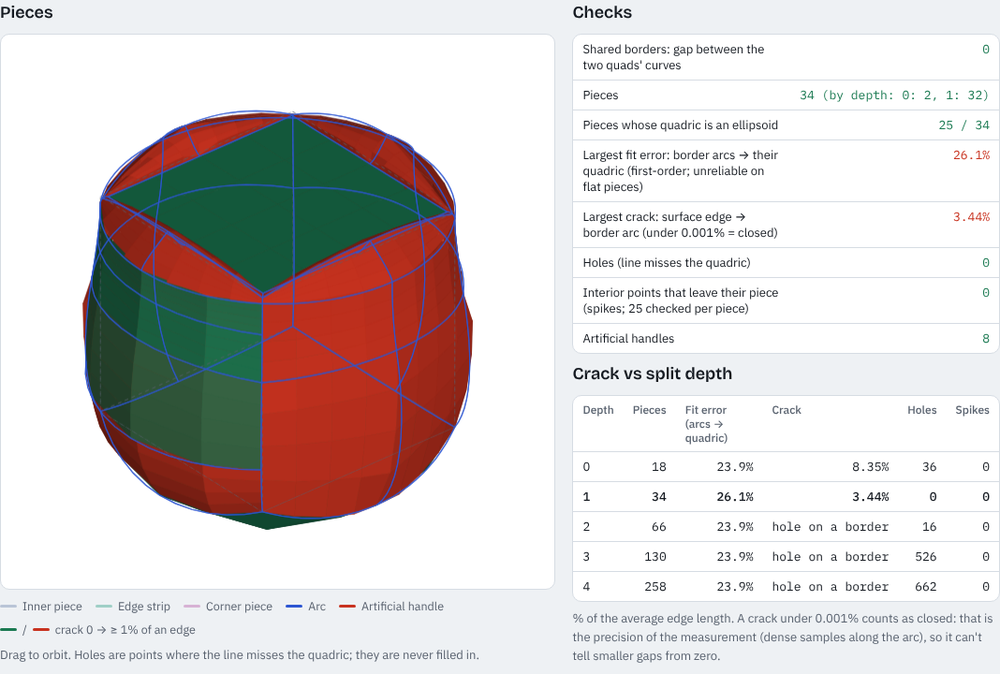
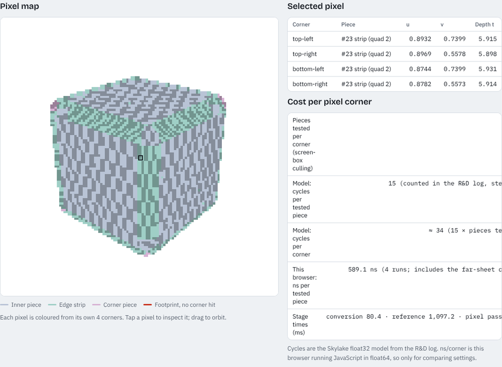
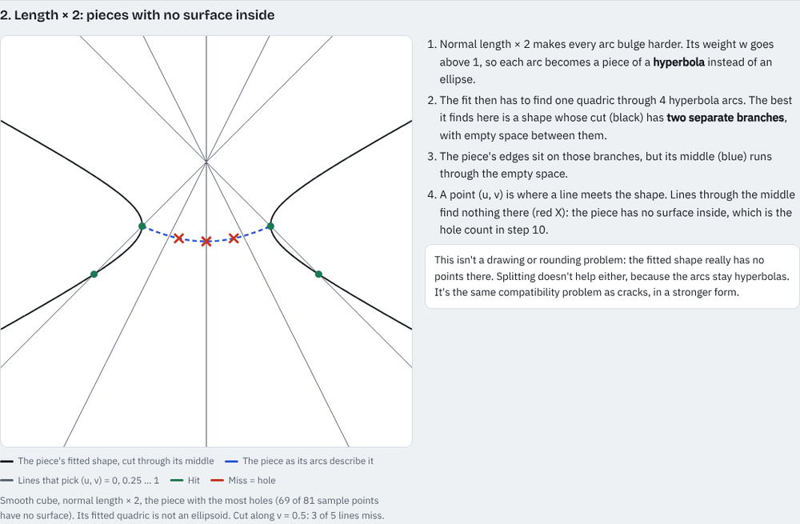

# curved-quad-mapping

R&D for a CPU-only, closed-form mapping between curved quad patches and screen pixels: `(quad, u, v) ↔ (pixel x, pixel y)`. No frame buffer and no GPU. The output feeds a spatial occlusion system. The final prototype will be written in Odin.

**Live pages:** https://zieviox.github.io/curved-quad-mapping/ (needs GitHub Pages: Settings → Pages → deploy from `main`, folder `/`).
GitHub itself shows HTML files as source code, so each example below also has a **Preview** link through [htmlpreview.github.io](https://htmlpreview.github.io), which runs it straight from the repo (public repo only).

- [`docs/rnd-log.md`](docs/rnd-log.md): every step in order: what was tried, the numbers, what was decided.
- [`examples/`](examples): one standalone HTML page per step. Works in any browser, phone or desktop.
- [`index.html`](index.html): the same steps as a gallery page.

## Steps

### 0 · Surface lab — [Preview](https://htmlpreview.github.io/?https://github.com/Zieviox/curved-quad-mapping/blob/main/examples/00-curved-quad-lab.html) · [Source](examples/00-curved-quad-lab.html)

Nagata, Phong, PN-quad and the ellipsoid variants side by side against a Catmull-Clark target, with the displacement-map test and the cost tables. The ellipsoid views were added in steps 4–6.

### 1 · Derivative-step walker (dropped) — [Preview](https://htmlpreview.github.io/?https://github.com/Zieviox/curved-quad-mapping/blob/main/examples/01-pixel-walk-test.html) · [Source](examples/01-pixel-walk-test.html)

Walks each patch in steps of about one projected pixel and measures gaps against a dense reference. It leaves gaps (2.54% on the cube at 256²). Fixing them nearly doubles the work. Dropped for an exact mechanism.

### 2 · Exact crossings along a row — [Preview](https://htmlpreview.github.io/?https://github.com/Zieviox/curved-quad-mapping/blob/main/examples/02-row-explainer.html) · [Source](examples/02-row-explainer.html)

A pixel edge is a plane through the camera. Where a patch row crosses it is a quadratic for Nagata and Phong. That's exact along a row, but rows are 1D.

### 3 · Pixel grid as knives — [Preview](https://htmlpreview.github.io/?https://github.com/Zieviox/curved-quad-mapping/blob/main/examples/03-pixel-slices.html) · [Source](examples/03-pixel-slices.html)

Each pixel edge slices the patch. A pixel corner on the patch has a closed form (a quadratic) on a quadric or a bilinear patch. On Phong and Nagata it's degree 8, so no closed form.

### 4–6 · Ellipsoid quads, S-split, neighbour trim — in the [surface lab](examples/00-curved-quad-lab.html)

- **4:** one quadric per quad, fitted to its corners and normals. Pixel corner → (u, v) is two quadratics.
- **5:** S-bends from an artificial point where an edge inverts, with one quadric per side. Pixel corner: 29 cycles per piece.
- **6:** trimming at the neighbour's crossing. Failed: neighbours that share normals touch at the corners instead of crossing.

### 7 · Literature check — in the [R&D log](docs/rnd-log.md)

Two conics share one quadric only if they meet twice, so one quadric per quad can't hold 4 edge curves.

### 8–9 · Handles and arcs — [Preview](https://htmlpreview.github.io/?https://github.com/Zieviox/curved-quad-mapping/blob/main/examples/04-handles-arcs.html) · [Source](examples/04-handles-arcs.html)

Face-corner normals as handles (direction = tangent, length = bulge), one ellipse arc between every two handles, and sharp edges rounded inside each quad by a blending distance. Shared borders match exactly. The hard cube becomes an exact rounded box, and the smooth cube's arcs lie exactly on the sphere. Each piece is then filled with one quadric (step 9b): compatible borders close (cube, sphere, wave), incompatible ones don't yet (mixed cube, 36%).

### 10 · Clean-slate conversion — [Preview](https://htmlpreview.github.io/?https://github.com/Zieviox/curved-quad-mapping/blob/main/examples/05-quad-pieces.html) · [Source](examples/05-quad-pieces.html)

Same math as step 9, with the conversion rewritten: lookups, vertex rounding, a shared arc cache, pieces, splits ("split further" with a depth limit) and measurement (cracks, holes, spikes). Compatible borders close. Incompatible ones get smaller with one split, but not exact.

### 11 · Pixel corners — [Preview](https://htmlpreview.github.io/?https://github.com/Zieviox/curved-quad-mapping/blob/main/examples/06-pixel-corners.html) · [Source](examples/06-pixel-corners.html)

Every pixel corner is a ray: piece's quadric (one quadratic), then its 4 side planes give (u, v). Smooth cube, rounded box and wave: 0 holes over 12 camera views. The mixed cube's cracks show as 14 holes in 19,252 corners. About 12–34 cycles per pixel in the cost model.

### 12 · Open problems explained — [Preview](https://htmlpreview.github.io/?https://github.com/Zieviox/curved-quad-mapping/blob/main/examples/07-open-problems.html) · [Source](examples/07-open-problems.html)

Cracks, pieces with no surface inside, and far-side hits, each with a picture (the first two computed from the real pieces).

Details and numbers are in the [R&D log](docs/rnd-log.md).
